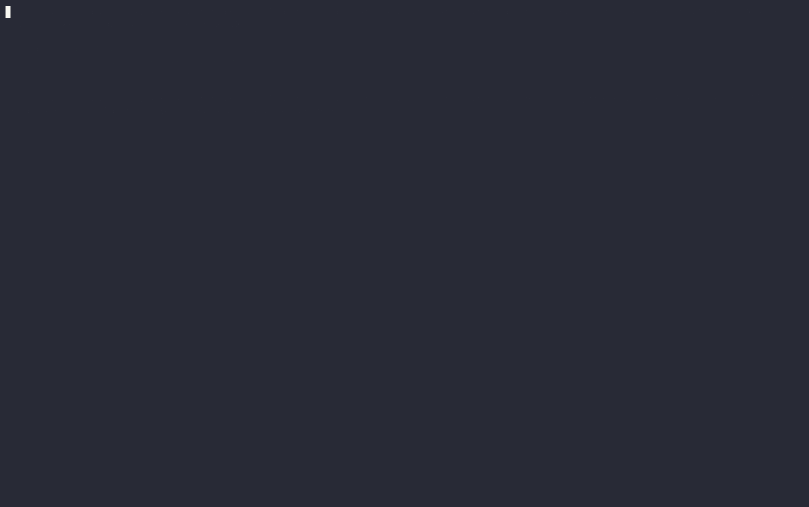

# AutoRoute

An OpenAI-compatible LLM router that picks the cheapest model likely to answer a
prompt well — built to run in production, not as a research demo.



Three prompts above, three tiers, no hardcoded model name — `auto` resolves to
`fast`/`smart`/`genius` via the real L1/L2 router, and `autoroute_route_decisions_total`
confirms which layer decided each one. Regenerate with `vhs docs/demo.tape`
(or `scripts/record-demo.sh` if `vhs` can't run a headless browser in your
environment).

## Why

Model routing is well-trodden (RouteLLM, Not Diamond, Martian, Arch-Router, vLLM
Semantic Router). What is missing from the open-source options is the boring
production layer: health checks, circuit breakers, graceful degradation,
first-class metrics, a Helm chart, and an **honest, reproducible eval harness**
whose numbers you can re-run yourself. That is what this project is — the
build story and the numbers that didn't flatter it are in
[`docs/BLOG.md`](docs/BLOG.md).

Design and rationale: [`docs/ARCHITECTURE.md`](docs/ARCHITECTURE.md) · visual
version: <https://claude.ai/code/artifact/acb0c124-dea8-43e5-ad7e-a7f5aa1e82c3>
· M0 de-risking spike: [`SPIKE.md`](SPIKE.md)

## Quickstart

```sh
make run     # start the proxy on :8080 with mock providers (no API key needed)
```

```sh
# non-streaming
curl localhost:8080/v1/chat/completions -H 'content-type: application/json' \
  -d '{"model":"fast","messages":[{"role":"user","content":"hello"}]}'

# streaming (SSE)
curl -N localhost:8080/v1/chat/completions -H 'content-type: application/json' \
  -d '{"model":"smart","stream":true,"messages":[{"role":"user","content":"hi"}]}'

# routed: "auto" resolves to a tier via L1 heuristics (+ L2 embedding classifier
# if this build has it — see "Two build modes" below), not a hardcoded name
curl localhost:8080/v1/chat/completions -H 'content-type: application/json' \
  -d '{"model":"auto","messages":[{"role":"user","content":"What is the capital of France?"}]}'

curl localhost:8080/healthz          # liveness
curl localhost:8080/readyz           # readiness (503 while draining)
curl localhost:8080/metrics          # Prometheus
curl localhost:8080/v1/models        # catalogue
```

To use a real provider, uncomment the `openai` models in
[`configs/catalogue.yaml`](configs/catalogue.yaml) and export `OPENAI_API_KEY`.

### Endpoints

| Method | Path | Purpose |
|---|---|---|
| `POST` | `/v1/chat/completions` | OpenAI-compatible; forwards to the catalogue model, relays streams |
| `GET` | `/v1/models` | catalogue as an OpenAI model list |
| `GET` | `/healthz` | liveness — always 200 while the process serves |
| `GET` | `/readyz` | readiness — 503 before startup and during shutdown drain |
| `GET` | `/metrics` | Prometheus (`autoroute_http_*`, `autoroute_upstream_*`, `autoroute_fallback_*`, `autoroute_circuit_breaker_*`, `autoroute_shadow_quality_delta`) |

### Other targets

```sh
make test    # all unit tests, race detector on
make cover   # print per-package + total test coverage (CI gates on 50%, -coverpkg=./...)
make build   # static binary -> bin/autoroute (CGO-free; router runs L1-only)
make build-router # binary with the real L2 embedding classifier (needs `make setup`)
make docker  # distroless container image (CGO-free build)
make demo    # proxy + Prometheus + Grafana via docker compose (:8080, :9090, :3000)
```

## How it's built

Four pieces, each shipped as its own milestone and still separable: a router
that knows when it's unsure, a reliability layer that assumes upstreams will
fail, an eval harness that publishes real numbers instead of picking flattering
ones, and a detector for the failure mode that trips no alarm at all. The
build story behind each is in [`docs/BLOG.md`](docs/BLOG.md); this section is
the reference version.

### The layered router (M2)

`configs/catalogue.yaml`'s `router:` block turns on routing: a request naming
`router.trigger_model` (default `auto`) is classified into a tier —
`cheap`/`mid`/`frontier` — instead of naming a catalogue model directly.
`router.tiers` maps each tier to a real catalogue model. Any other model name
is unaffected — still direct M1-style passthrough.

The pipeline is L1 heuristics (tokens, code fences, task verbs, turns, tools,
JSON) first; a request it can decide with high certainty never touches an
embedding call. A miss falls through to L2 — an in-process ONNX embedding
classifier — whose confidence against the nearest route decides `theta_low`/
`theta_high` bands: confident → that tier; uncertain → `router.default_tier`
(the conservative default). Every decision is counted
(`autoroute_route_decisions_total{tier,layer}`) and appended as a JSON line to
the decision log (`-decision-log`, default `data/decisions.jsonl`).

#### Two build modes

L2 needs the ONNX Runtime CGo binding; L1 doesn't. So:

- **`make build`** (default, `CGO_ENABLED=0`, what `make docker` uses) — no cgo
  dependency at all. The router still runs: L1 heuristics, and every L1 miss
  resolves straight to `default_tier` — a real instance of
  degrade-to-passthrough, not a crippled mode.
- **`make build-router`** (`CGO_ENABLED=1`, after `make setup` has fetched the
  ONNX Runtime + model) — adds the real L2 embedding classifier.

`make run`/`make test` are always `CGO_ENABLED=1` and pick up L2 automatically
once `make setup` has run, otherwise degrade the same way.

### Reliability & observability (M3)

Every outgoing call — a direct-named request or a routed one — goes through
`internal/reliability`: a circuit breaker per **provider** (not per tier), so
several tiers sharing a provider account share its health state too. After
`reliability.breaker_failure_threshold` (default 5) consecutive failures a
provider is skipped fast for `reliability.breaker_cooldown` (default 30s)
instead of hanging every request on a call likely to fail; a single probe
after cooldown decides whether to close again.

A **routed** (`"auto"`) request additionally gets a fallback chain: on a
transient failure (transport error, or 429/500/502/503/504) it climbs from its
assigned tier toward more capable ones — `cheap → mid → frontier`, then
`router.passthrough_default` as the final safety net — never back down to a
cheaper tier. A **direct-named** request (M1-style) is still exactly one
attempt: the chain is inherently tier-shaped, so naming a specific model gets
you that model or an honest error, not a silent substitution — it does still
benefit from the breaker's fail-fast behavior. Every hop is counted
(`autoroute_fallback_total{from,to}`), and breaker state/trips are their own
metrics (`autoroute_circuit_breaker_state`, `autoroute_circuit_breaker_trips_total`).

`make demo` now also brings up Grafana (`:3000`, admin/admin) with a
pre-provisioned "AutoRoute" dashboard covering every metric from M1–M3
(`deploy/grafana/`). `deploy/helm/autoroute/` is a minimal chart — Deployment,
Service, ConfigMap for the catalogue, `/healthz`/`/readyz` probes, Prometheus
scrape annotations:

```sh
helm lint deploy/helm/autoroute
helm install autoroute deploy/helm/autoroute
```

No Ingress, HPA, PodDisruptionBudget, or ServiceMonitor CRD — bring your own
if you need them; see `deploy/helm/autoroute/templates/NOTES.txt`.

### Eval harness (M4)

`eval/` replays [RouterBench](https://huggingface.co/datasets/withmartian/routerbench)
(36,497 real prompts across 86 benchmark categories — MMLU, HellaSwag, GSM8K,
MT-Bench, Winogrande, ARC-Challenge and more; DOI `10.57967/hf/1996`) through
the **exact same** `router.ExtractSignals` → `RouteL1` → `RouteL2` path
`internal/proxy` drives in production (`eval/harness.go`) — not a
reimplementation that could quietly drift from what actually ships.
RouterBench already ran 11 real models against every prompt and recorded
cost + correctness, so the harness needs no API keys: it looks a routed
prompt's chosen model up in that table.

```sh
make eval-setup   # fetch RouterBench (~100MB) + convert pickle -> csv (needs python3/pip)
make eval         # replay it, write eval/RESULTS.md + eval/RESULTS_chart.svg + eval/results.json
```

AutoRoute's three tiers map onto RouterBench's cheapest, a mid-cost, and the
highest-quality model (picked by cost from the dataset itself — see
`eval.Tiers` in `eval/harness.go`). Rows are split by benchmark category
(`eval/split.go`): ~80% train, ~20% held out — deterministic, and honest by
construction since nothing in `internal/router` was tuned against
RouterBench. `.github/workflows/eval.yml` re-runs this weekly (and on
demand) as a **regression gate**: it fails if the held-out numbers drift from
the committed `eval/results.json` beyond a fixed tolerance
(`eval.CheckDrift`) — it never commits a result back; a real drift is a
human decision, not a bot's.

See [`eval/RESULTS.md`](eval/RESULTS.md) for the actual numbers.

### Shadow detector (M5)

A worse-but-well-formed cheap-tier answer trips no error or latency alarm —
`internal/shadow` is the only thing that catches it. `configs/catalogue.yaml`'s
`shadow:` block turns it on:

```yaml
shadow:
  enabled: true
  sample_rate: 0.05     # fraction of eligible requests sampled
  alert_threshold: 0.15 # logged warning above this; also the Prometheus rule's threshold
```

Eligible = a **router-decided cheap-tier, non-streaming** response (matching
M3's precedent that routing-specific features apply only to `"auto"`-routed
traffic, not direct-named requests; streaming is excluded because
reconstructing full answer text from SSE deltas just to score it isn't worth
the complexity — a non-streaming shadow test already exercises the identical
router decision and model quality). For a sampled request: after the client
already has its response, `internal/proxy/shadow.go` replays the same prompt
against the frontier model in its own goroutine — never blocking or
affecting the real response — and `internal/shadow.Sampler.Score` computes
`1 - cosine(embed(cheapAnswer), embed(frontierAnswer))` using the same
in-process ONNX embedder already loaded for L2 routing (no second model
load, no judge model — the doc's prose mentions "embedding similarity +
judge," but no L3 judge exists anywhere in this codebase yet; embedding
similarity alone is what M5 ships).
`autoroute_shadow_quality_delta` records every sample; a Prometheus rule
(`deploy/compose/prometheus-alerts.yml`) fires `ShadowQualityDegraded` when
its rolling 10-minute mean exceeds 0.15 for 5 minutes — visible in
Prometheus's own `/alerts` UI. No Alertmanager is wired up; bring your own
notification channel on top, same stance M3 already took on
Ingress/HPA/ServiceMonitor.

Because shadow sampling needs the L2 embedder, it's subject to the same "two
build modes" split as routing itself: the default `make build`/`make docker`
image is CGO-free, so shadow sampling — like L2 routing confidence — is
silently disabled there (logged, not fatal) even with `shadow.enabled:
true`. Run locally with `make run` after `make setup`, or `make
build-router`, to see it fire for real.

## The M0 spike (embedding router)

The routing brain was prototyped separately first — see [`SPIKE.md`](SPIKE.md).

```sh
make setup   # fetch ONNX Runtime + all-MiniLM-L6-v2 (~150 MB, into gitignored dirs)
make spike   # embed the worked-example prompts, print routing decisions + latency
```

## Layout

```
cmd/autoroute/          the proxy
cmd/spike-embed/        M0 embedding/routing spike
internal/config/        model catalogue + router + reliability config
internal/openai/        minimal chat-completions schema (peek + model rewrite)
internal/provider/      upstream adapters — openai-compatible, mock
internal/proxy/         HTTP edge: routes, relay, routing, dispatch, health, instrumentation
internal/observability/ Prometheus metrics + the router decision log
internal/embed/         WordPiece tokenizer + in-process ONNX embedder (cgo-isolated)
internal/router/        L1 heuristics + L2 nearest-centroid classifier + pipeline
internal/reliability/   per-provider circuit breakers + the fallback-chain dispatcher
internal/shadow/        M5 shadow detector: sampling + embedding-similarity scoring
eval/                   RouterBench loader, split, harness, RESULTS.md/chart/json generation
cmd/eval/               the eval CLI (`make eval`)
scripts/convert-routerbench.py  one-time pickle -> csv conversion (the only Python here)
deploy/compose/         docker-compose demo (proxy + Prometheus + Grafana)
deploy/compose/prometheus-alerts.yml  the M5 ShadowQualityDegraded alert rule
deploy/grafana/         provisioned datasource + AutoRoute dashboard
deploy/helm/autoroute/  Helm chart
docs/ARCHITECTURE.md    full design
docs/BLOG.md            build story + honest findings, M0-M5
docs/demo.tape          vhs script -> docs/demo.gif
scripts/record-demo.sh  asciinema+agg fallback for docs/demo.gif (see docs/demo.tape)
```

## Roadmap

| | Branch | State |
|---|---|---|
| M0 | `m0-spike` | ✅ in-process ONNX embedding + nearest-centroid router |
| M1 | `m1-proxy-skeleton` | ✅ OpenAI-compatible proxy: forward, stream, health, metrics, Docker |
| M2 | `m2-layered-router` | ✅ L1 heuristics + L2 embedding + confidence band; decision log; degrade-to-passthrough |
| M3 | `m3-reliability-observability` | ✅ breakers, fallback chain, full metrics, Grafana, Helm |
| M4 | `m4-eval-harness` | ✅ RouterBench replay, published numbers, break-even |
| M5 | `m5-shadow-detector` | ✅ shadow sampling + quality-delta metric + alert |
| **M6** | `m6-flagship-polish` | **⬅ README, blog draft, demo GIF** |

## License

TBD (will be Apache-2.0).
