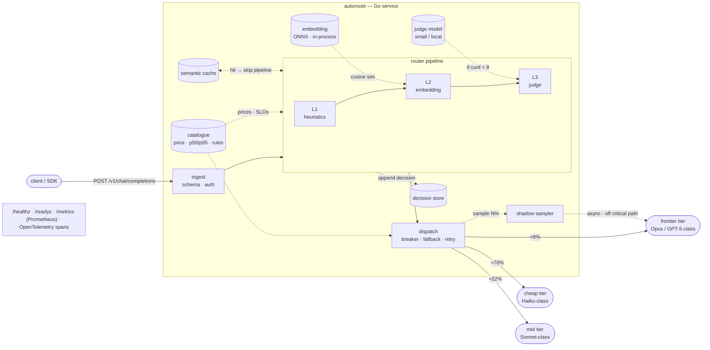
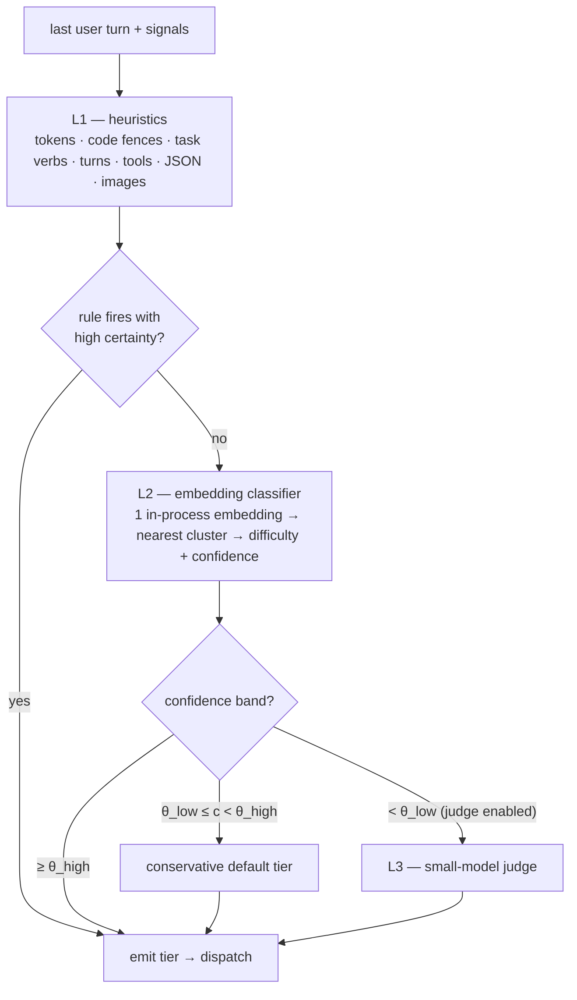
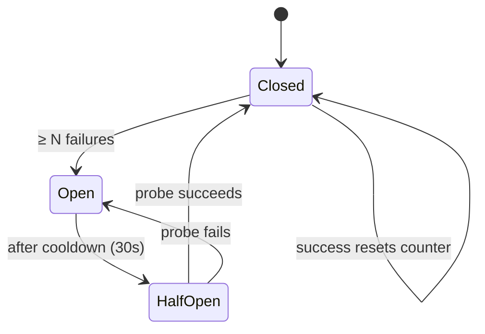

# AutoRoute — Architecture

> Design phase. This document describes the target system; see
> [`../SPIKE.md`](../SPIKE.md) for what is actually built (M0). Traffic shares and
> confidence values in the examples are illustrative pending the M4 eval run.
>
> Rendered / visual version:
> <https://claude.ai/code/artifact/acb0c124-dea8-43e5-ad7e-a7f5aa1e82c3>

## Overview

AutoRoute is an OpenAI-compatible proxy that picks the cheapest model likely to
answer a prompt well. A request enters as an OpenAI-compatible call and leaves as
one. In between:

- the **router** adds a decision — which model tier — from cheap signals, making
  **zero LLM calls** on the common path;
- the **dispatcher** adds resilience — circuit breaker, fallback chain, retry
  budget, degrade-to-passthrough.

Everything else (the embedding model, caches, stores, the shadow sampler) hangs
off that spine and is observable.

The routing *idea* is well-explored (RouteLLM, Not Diamond, Martian, Arch-Router,
vLLM Semantic Router). The differentiator here is the production layer those
projects mostly lack: health checks, graceful degradation, first-class metrics, a
Helm chart, and a reproducible eval harness whose numbers are published and
re-runnable.

## System architecture



| Component | Responsibility |
|---|---|
| **ingest** | Parse the OpenAI request, authenticate, normalise. Pull the last user turn + context signals. |
| **router pipeline** | L1 rules → L2 embedding classifier → L3 optional judge. Emits a `RouteDecision`. |
| **catalogue** | Config: model list, live prices, measured p50/p95 latency, and the domain→tier rules. |
| **semantic cache** | Near-duplicate prompt → reuse the prior decision, skip the pipeline. |
| **decision store** | Append-only log of every decision + features, for eval replay and debugging. |
| **shadow sampler** | Replays N% of cheap-routed prompts against the frontier model, off the critical path, to catch silent quality loss. |
| **dispatch** | Per-provider circuit breaker, fallback chain, retry budget, degrade-to-passthrough. |
| **observability** | Kubernetes probes, Prometheus metrics, OpenTelemetry traces — every component reports here. |

The embedding model runs **in the process** — no embedding API call — which is
the specific thing that keeps RouteLLM and vLLM Semantic Router off the fast
path. The dispatcher is where provider failures are absorbed; the router never
talks to a provider directly.

## The decision pipeline

The router predicts the *prompt's* difficulty and category, then maps that to a
model tier decided offline. It never calls the candidate models to compare them —
that would cost N× per request. Each layer can end the decision; later layers run
only when the earlier one is not confident enough.



`θ_low` and `θ_high` are the two knobs. Widen the gap and more traffic reaches
the judge (better decisions, more latency, a tiny cost); set `θ_low = 0` and the
judge never runs. The uncertain middle band always resolves to the **conservative
default** (frontier) — the router fails toward quality, and the metrics tell you
how often it does.

### Per-request latency & cost budget

| Path | What runs | Added latency | Added cost | Traffic share |
|---|---|--:|--:|---|
| **L1 only** | Pure Go: tokenise, regex, feature checks | ~0.3 ms | $0 | large — most short / obvious prompts |
| **+ L2** | One embedding (MiniLM / bge-small) in-process on CPU, nearest-cluster lookup | ~2–25 ms | ≈ $0 | most of the remainder |
| **+ L3** | One call to a small / local judge model — never the frontier model | ~200–400 ms | ~$0.00004 | the uncertain band only — tunable, can be 0% |

Measured L2 latency in the M0 spike: **warm p50 2.4 ms** on Apple Silicon CPU
(see [`../SPIKE.md`](../SPIKE.md)).

## Worked examples

Same pipeline every time; only the layer that decides changes.

| # | Prompt (abridged) | Decided at | Signal | Route |
|---|---|---|---|---|
| A | "Who is the prime minister of India?" | **L1** | 9 tokens · no code · single turn · factual-lookup shape | `cheap` |
| B | "Prove the sum of the first n odd numbers is n²." | **L2**, conf 0.91 | nearest cluster "formal-math / proof" · difficulty 0.88 | `frontier` |
| C | "Make this idiomatic and add type hints: `def f(x): …`" | **L1** | fenced code block · imperative edit verb · bounded scope | `mid` (code) |
| D | "B2B pricing change, seats → usage. Is this a good idea?" | **L3** | L2 torn between "business-advice" and "casual-opinion" (conf 0.58 &lt; θ) → judge says "needs frontier" | `frontier` |
| E | "Rewrite this sentence to sound more formal." | **L1** | short · rewrite verb · no context | `cheap` |
| F | "Extract every date in this text and return JSON." | **L2** | nearest cluster "structured-extraction" | `mid` |

With the judge disabled, D takes the conservative default (frontier) straight
from L2's uncertain band — same route, no added latency, but the router can't
tell you *why*.

**E · failure path.** Suppose E is routed `cheap` and the cheap provider returns
`503`:

```
dispatch → cheap provider  ✗ 503
         → circuit breaker records failure (opens after N; half-opens after 30s)
         → fallback → mid provider → 200 OK to client
```

The client sees **one `200`, +40 ms, no error**. Metric:
`autoroute_fallback_total{from="cheap",to="mid"} += 1`. If every tier fails,
degrade to passthrough → a configured default model, metric emitted, never a hard
`5xx`.

**F · silent-quality check (asynchronous).** After the cheap response is served,
1 in N cheap-routed prompts is replayed against the frontier model off the
critical path; both answers are scored (embedding similarity + judge) and the
delta recorded as `autoroute_shadow_quality_delta`. Alert if the rolling mean
delta exceeds 0.15 — a worse-but-well-formed answer trips no error or latency
alarm, and this is the only thing that catches it.

## Failure & degradation

Provider failures are routine, not exceptional — `5xx`, rate limits, latency
spikes to tens of seconds. Each provider is wrapped in a circuit breaker so a
sick provider is skipped fast instead of timing out on every request.



One breaker **per provider**, not per tier. The fallback chain is
`cheap → mid → frontier → passthrough default`; each hop is a counter, so a
rising `autoroute_fallback_total` is an early signal a provider is degrading
before it fully fails.

## What gets measured

The differentiator is not the routing algorithm — it is that the numbers are
honest and re-runnable. The eval harness replays RouterBench plus a held-out set
through the router in CI and commits the results; the runtime metrics tell you
whether the deployed router is behaving like the eval said it would.

| Metric | Type | Answers |
|---|---|---|
| `autoroute_route_decisions_total{tier,layer}` | counter | Where is traffic going, and which layer decided? |
| `autoroute_decision_latency_seconds` | histogram | What is the router adding to p50 / p95? |
| `autoroute_cheap_model_recall` | gauge | Of prompts a cheap model could have handled, what share did we route cheap? *(the metric every commercial router quietly fails — see RouterArena)* |
| `autoroute_fallback_total{from,to}` | counter | How often is a provider failing us? |
| `autoroute_shadow_quality_delta` | histogram | Are cheap routes silently worse? |
| `autoroute_cost_usd_total` vs `autoroute_baseline_usd_total` | counter | Actual spend vs always-frontier — the real saving, measured. |

### Honest break-even

Routing is a cost you add hoping to remove a bigger one. Embedding-only routing
(~15 ms, ≈ $0) clears that bar almost always. The judge (~300 ms, a fraction of a
cent) only pays off on genuinely ambiguous prompts and must be switchable off.
The saving is the model price gap avoided — frontier ≈ $15 / M output vs cheap
≈ $0.25 / M — which only matters if a real fraction of traffic is genuinely
routable. The harness reports that fraction for the benchmark; production mileage
is your own traffic.

## Deliberately out of scope

- **Not a full multi-provider gateway.** LiteLLM already does that — AutoRoute can
  sit in front of or behind it.
- **Not a new state-of-the-art routing model.** Known-good strategies are
  integrated behind a pluggable `Router` interface and measured fairly.
- **Not a hosted service.** Self-hosted, single binary, your infrastructure, your
  keys.
- **No retraining to add a model.** Tiers and domain→tier rules are config,
  Arch-Router-style.

## Repository layout (target)

```
cmd/autoroute/            main
cmd/spike-embed/          M0 spike (built)
internal/embed/           WordPiece tokenizer + in-process ONNX embedder (built)
internal/router/          Router iface, layered pipeline, exemplars + L2 classifier (partial)
internal/proxy/           OpenAI schema, streaming, provider adapters
internal/reliability/     breaker, fallback, degrade
internal/observability/   prom metrics, otel, decision log
internal/shadow/          silent-quality-failure detector
eval/                     harness, RouterBench loader, chart gen, RESULTS.md
deploy/helm/ deploy/grafana/ deploy/compose/
docs/                     this file, benchmark methodology, blog draft
```

## Milestones

| | Branch | State |
|---|---|---|
| **M0** | `m0-spike` | ✅ in-process ONNX embedding + nearest-centroid router; latency + RouterBench access confirmed |
| **M1** | `m1-proxy-skeleton` | OpenAI-compatible passthrough to 2 providers, streaming, `/healthz` `/readyz` `/metrics`, Docker |
| **M2** | `m2-layered-router` | heuristics + embedding classifier + confidence band; decision log + traces; degrade-to-passthrough |
| **M3** | `m3-reliability-observability` | breakers, fallback chain, full Prometheus set, Grafana dashboard, Helm chart |
| **M4** | `m4-eval-harness` | RouterBench + held-out replay, cost-vs-quality chart, `RESULTS.md`, CI job, break-even analysis |
| **M5** | `m5-shadow-detector` | shadow sampling + quality-delta metric + alert |
| **M6** | `m6-flagship-polish` | README, blog draft, demo GIF |
