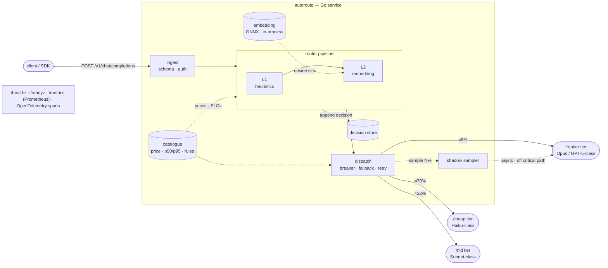
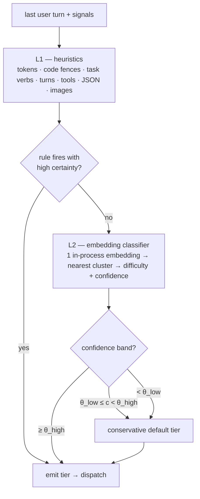
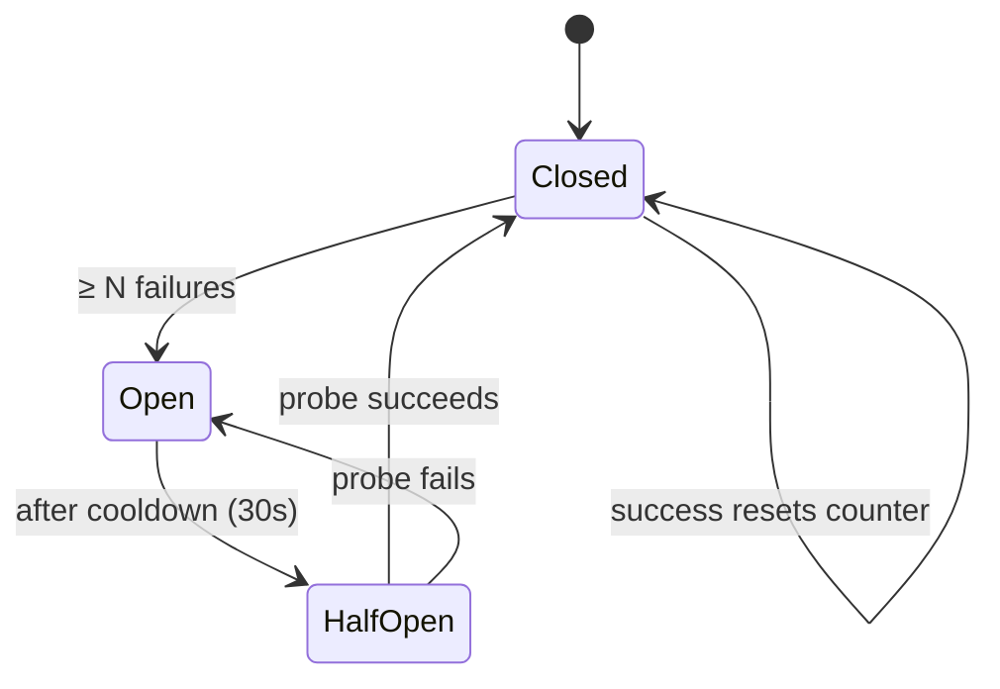

# AutoRoute — Architecture

> Traffic shares and confidence values in the worked examples below are
> illustrative, not measured production traffic — see
> [`../eval/RESULTS.md`](../eval/RESULTS.md) for the real numbers from the
> eval harness.
>
> Rendered / visual version: [`architecture.html`](architecture.html)

## Overview

AutoRoute is an OpenAI-compatible proxy that picks the cheapest model likely to
answer a prompt well. A request enters as an OpenAI-compatible call and leaves as
one. In between:

- the **router** adds a decision — which model tier — from cheap signals, making
  **zero LLM calls** on the common path;
- the **dispatcher** adds resilience — circuit breaker, fallback chain, retry
  budget, degrade-to-passthrough.

Everything else (the embedding model, the decision store, the shadow sampler)
hangs off that spine and is observable.

The routing *idea* is well-explored (RouteLLM, Not Diamond, Martian, Arch-Router,
vLLM Semantic Router). The differentiator here is the production layer those
projects mostly lack: health checks, graceful degradation, first-class metrics, a
Helm chart, and a reproducible eval harness whose numbers are published and
re-runnable.

## System architecture



| Component | Responsibility |
|---|---|
| **ingest** | Parse the OpenAI request, authenticate, normalise. Pull the last user turn + context signals. |
| **router pipeline** | L1 rules → L2 embedding classifier with confidence bands. Emits a `RouteDecision`. |
| **catalogue** | Config: model list, live prices, measured p50/p95 latency, and the domain→tier rules. |
| **decision store** | Append-only log of every decision + features, for eval replay and debugging. |
| **shadow sampler** | Replays N% of cheap-routed prompts against the frontier model, off the critical path, to catch silent quality loss. |
| **dispatch** | Per-provider circuit breaker, fallback chain, retry budget, degrade-to-passthrough. |
| **observability** | Kubernetes probes, Prometheus metrics, OpenTelemetry traces — every component reports here. |

The embedding model runs **in the process** — no embedding API call — which is
the specific thing that keeps RouteLLM and vLLM Semantic Router off the fast
path. The dispatcher is where provider failures are absorbed; the router never
talks to a provider directly.

## The decision pipeline

The router predicts the *prompt's* difficulty and category, then maps that to a
model tier decided offline. It never calls the candidate models to compare them —
that would cost N× per request. Each layer can end the decision; later layers run
only when the earlier one is not confident enough.



Above `θ_high`, L2's pick stands. Below it — whether in the uncertain middle
band or under `θ_low` — the router falls back to the **conservative default**
(frontier): it fails toward quality rather than guessing. The two sub-bands
are tagged separately in the decision log and metrics
(`L2-band-default` vs `degraded-low-confidence`) so you can tell them apart,
but today they resolve identically. `θ_low` is a reserved knob for a future
L3 judge layer that would arbitrate the low-confidence band instead of
taking the default outright — not built yet (see
`internal/router/pipeline.go`).

### Per-request latency & cost budget

| Path | What runs | Added latency | Added cost | Traffic share |
|---|---|--:|--:|---|
| **L1 only** | Pure Go: tokenise, regex, feature checks | ~0.3 ms | $0 | large — most short / obvious prompts |
| **+ L2** | One embedding (MiniLM / bge-small) in-process on CPU, nearest-cluster lookup | ~2–25 ms | ≈ $0 | most of the remainder |

Measured L2 latency during development: **warm p50 2.4 ms** on Apple Silicon
CPU.

## Worked examples

Same pipeline every time; only the layer that decides changes.

| # | Prompt (abridged) | Decided at | Signal | Route |
|---|---|---|---|---|
| A | "What is the capital of France?" | **L1** | 6 words · no code · single turn · factual-lookup shape | `cheap` |
| B | "Prove the sum of the first n odd numbers is n²." | **L2**, conf 0.91 | nearest cluster "formal-math / proof" · difficulty 0.88 | `frontier` |
| C | "Make this idiomatic and add type hints: `def f(x): …`" | **L1** | fenced code block · imperative edit verb · bounded scope | `mid` (code) |
| D | "B2B pricing change, seats → usage. Is this a good idea?" | **L2**, conf 0.58 (below θ_low) | L2 torn between "business-advice" and "casual-opinion" → low confidence, conservative default | `frontier` |
| E | "Rewrite this sentence to sound more formal." | **L1** | short · rewrite verb · no context | `cheap` |
| F | "Extract every date in this text and return JSON." | **L2** | nearest cluster "structured-extraction" | `mid` |

D lands in L2's low-confidence band, so it takes the conservative default
(frontier) — no added latency, but (today) no second opinion either.

**E · failure path.** Suppose E is routed `cheap` and the cheap provider returns
`503`:

```
dispatch → cheap provider  ✗ 503
         → circuit breaker records failure (opens after N; half-opens after 30s)
         → fallback → mid provider → 200 OK to client
```

The client sees **one `200`, +40 ms, no error**. Metric:
`autoroute_fallback_total{from="cheap",to="mid"} += 1`. If every tier fails,
degrade to passthrough → a configured default model, metric emitted, never a hard
`5xx`.

**F · silent-quality check (asynchronous).** After the cheap response is served,
1 in N cheap-routed prompts is replayed against the frontier model off the
critical path; both answers are scored by embedding similarity
(`1 - cosine(embed(cheap), embed(frontier))`, no judge model) and the
delta recorded as `autoroute_shadow_quality_delta`. Alert if the rolling mean
delta exceeds 0.15 — a worse-but-well-formed answer trips no error or latency
alarm, and this is the only thing that catches it.

## Failure & degradation

Provider failures are routine, not exceptional — `5xx`, rate limits, latency
spikes to tens of seconds. Each provider is wrapped in a circuit breaker so a
sick provider is skipped fast instead of timing out on every request.



One breaker **per provider**, not per tier. The fallback chain is
`cheap → mid → frontier → passthrough default`; each hop is a counter, so a
rising `autoroute_fallback_total` is an early signal a provider is degrading
before it fully fails.

## What gets measured

The differentiator is not the routing algorithm — it is that the numbers are
honest and re-runnable. The eval harness replays RouterBench plus a held-out set
through the router in CI and commits the results; the runtime metrics tell you
whether the deployed router is behaving like the eval said it would.

| Metric | Type | Answers |
|---|---|---|
| `autoroute_route_decisions_total{tier,layer}` | counter | Where is traffic going, and which layer decided? |
| `autoroute_decision_latency_seconds` | histogram | What is the router adding to p50 / p95? |
| `autoroute_router_degraded_total` | counter | How often did the router miss a confident pick and fall back to the default tier? |
| `autoroute_fallback_total{from,to}` | counter | How often is a provider failing us? |
| `autoroute_circuit_breaker_state` / `_trips_total` | gauge / counter | Is a provider's breaker open right now, and how often has it tripped? |
| `autoroute_shadow_quality_delta` | histogram | Are cheap routes silently worse? |

Cheap-model recall and cost-vs-baseline savings aren't live Prometheus
metrics — they need RouterBench's ground truth to compute, which the running
proxy doesn't have. They're the eval harness's job instead: `eval/RESULTS.md`
publishes both, and `.github/workflows/eval.yml` re-checks them weekly
against the committed baseline.

### Honest break-even

Routing is a cost you add hoping to remove a bigger one. Embedding-only
routing (~15 ms, ≈ $0) clears that bar almost always. The saving is the model
price gap avoided — frontier ≈ $15 / M output vs cheap ≈ $0.25 / M — which
only matters if a real fraction of traffic is genuinely routable.

On RouterBench's held-out split (4,436 rows the thresholds were never tuned
against), the measured answer is **2.5% cheaper than always calling the
frontier model, at 80.4% accuracy versus 81.4%** — a real but modest win, not
a dramatic one. RouterBench is academic-exam-style prompts (MMLU, GSM8K,
Winogrande); the L1 rules and L2 exemplars were authored for general
assistant chat, so they don't confidently discriminate this benchmark's
traffic — **95.6% of held-out rows land in the conservative default** rather
than a confident L2 pick, and the router pays the frontier price rather than
guess. See [`../eval/RESULTS.md`](../eval/RESULTS.md) for the full numbers
and [`BLOG.md`](BLOG.md) for the reasoning behind them.

## Deliberately out of scope

- **Not a full multi-provider gateway.** LiteLLM already does that — AutoRoute can
  sit in front of or behind it.
- **Not a new state-of-the-art routing model.** Known-good strategies are
  integrated behind a pluggable `Router` interface and measured fairly.
- **Not a hosted service.** Self-hosted, single binary, your infrastructure, your
  keys.
- **No retraining to add a model.** Tiers and domain→tier rules are config,
  Arch-Router-style.

See the repository's own file tree for the layout — it's the one copy of
this that can't go stale.
