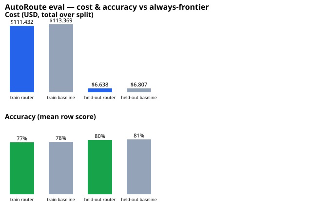

# AutoRoute eval results

Generated by `make eval` (`cmd/eval`) against RouterBench (huggingface.co/datasets/withmartian/routerbench), replayed through the same router pipeline internal/proxy uses in production — see eval/harness.go. Not fabricated: this is `go run ./cmd/eval` output, re-run it yourself with `make eval-setup && make eval`.

**Router mode:** L1+L2 (real ONNX embedder)

**Tiers:**

| Tier | Model |
|---|---|
| cheap | `mistralai/mistral-7b-chat` |
| mid | `gpt-3.5-turbo-1106` |
| frontier | `gpt-4-1106-preview` |

## Results

| Split | N | Routed cost | Baseline cost (always-frontier) | Savings | Routed accuracy | Baseline accuracy | Cheap-model recall |
|---|--:|--:|--:|--:|--:|--:|--:|
| train | 32061 | $111.4316 | $113.3689 | 1.7% | 77.1% | 77.7% | 0.8% |
| held-out | 4436 | $6.6375 | $6.8067 | 2.5% | 80.4% | 81.4% | 2.4% |

## Decisions by tier

| Split | Tier | Rows |
|---|---|--:|
| train | cheap | 247 |
| train | frontier | 31501 |
| train | mid | 313 |
| held-out | cheap | 101 |
| held-out | frontier | 4313 |
| held-out | mid | 22 |

## Decisions by layer

| Split | Layer | Rows |
|---|---|--:|
| train | L2 | 6629 |
| train | L2-band-default | 6967 |
| train | degraded-low-confidence | 18465 |
| held-out | L2 | 195 |
| held-out | L2-band-default | 1051 |
| held-out | degraded-low-confidence | 3190 |

## What this suggests

L1 heuristics decided only **0.0%** of held-out rows, and **95.6%** landed in the conservative-default path (L2 confidence below `theta_low`, or L2 unavailable) rather than a confident tier decision. That's the L1 rules and L2 exemplars — authored for general assistant chat in M0-M2 — not confidently discriminating this benchmark's academic-exam-style prompts (MMLU, GSM8K, Winogrande, ...), not a bug in the harness. It's exactly the failure mode `docs/ARCHITECTURE.md` calls out: "the uncertain middle band always resolves to the conservative default — the router fails toward quality." Expanding the L2 route taxonomy to cover benchmark-style traffic is future work, not this milestone's.

## Honest break-even

Routing saved **2.5%** of the always-frontier cost on the held-out slice, at **80.4** points of accuracy vs 81.4 for always-frontier — the price of not calling the frontier model for every prompt. Cheap-model recall of **2.4%** means that's how often, of the prompts a cheap model actually could have answered correctly, the router agreed and sent it there.

